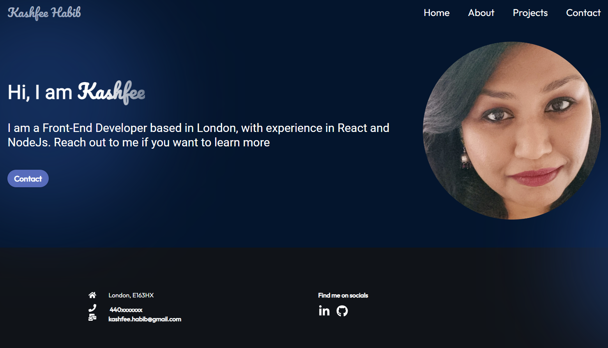
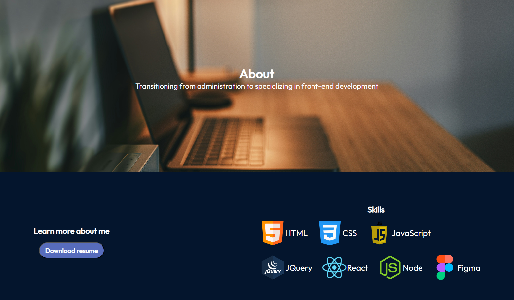
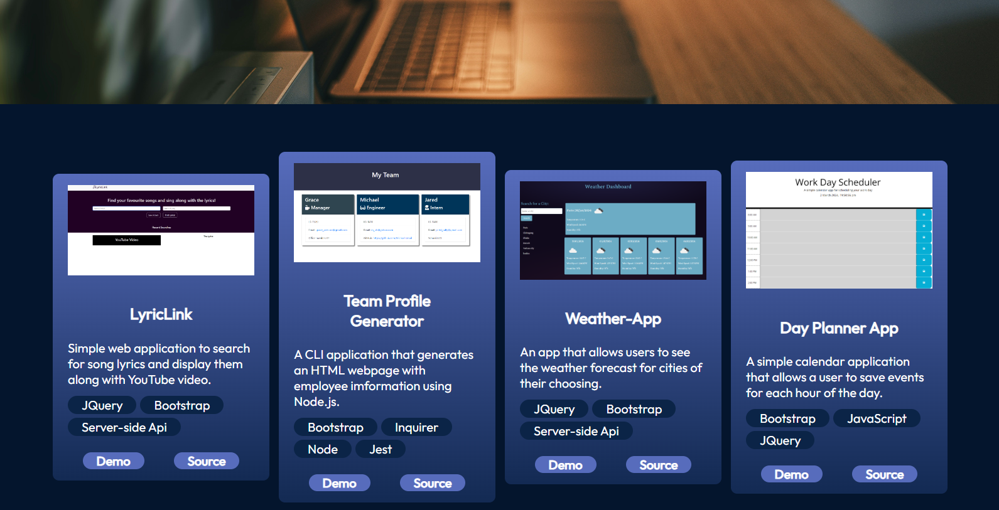
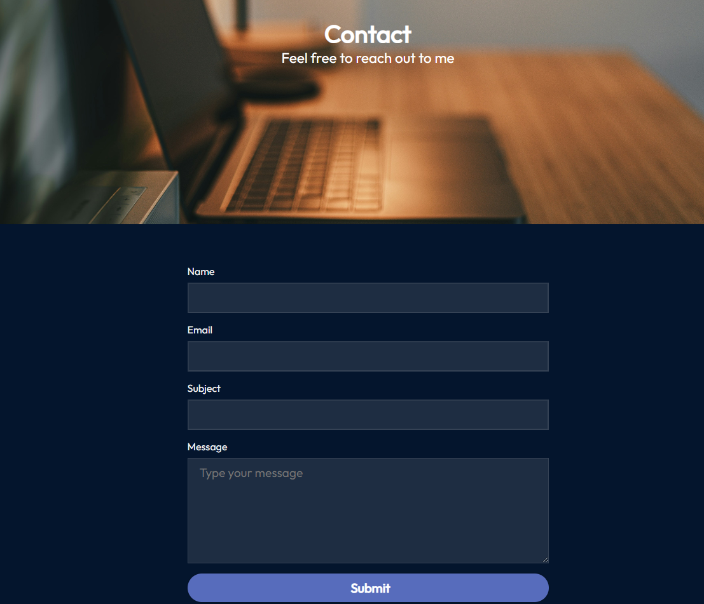

# Module 13 : REACT portfolio

## Description

This week's challenge was to create a react portfolio and it is mobile responsive 

## Technologies Used

* React
* ES6
* HTML
* CSS

##  Usage
Please navigate to https://kashfeeh.github.io/react-portfolio/

## Contributions
As always, as I am a complete novice in this field, any contributions to improve or correct the work would be highly appreciated. 

 ## License
Distributed under the MIT License. See LICENSE.txt for more information.
